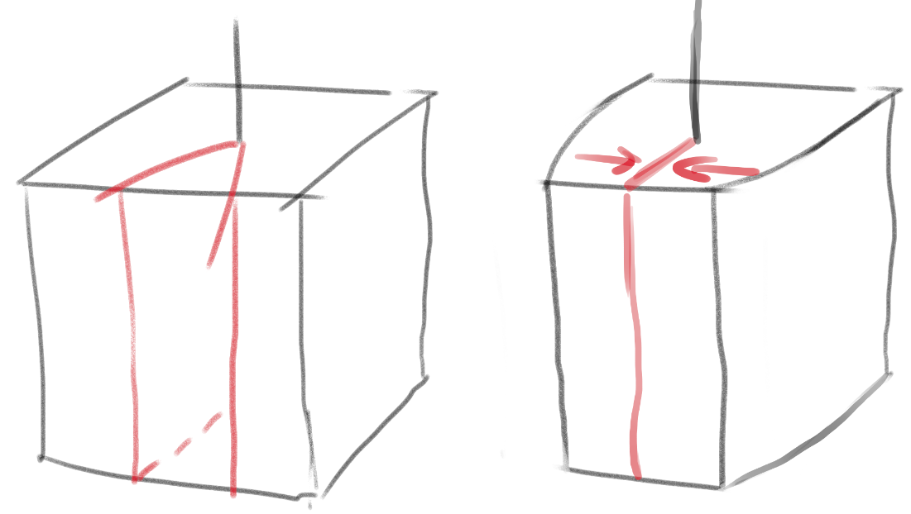
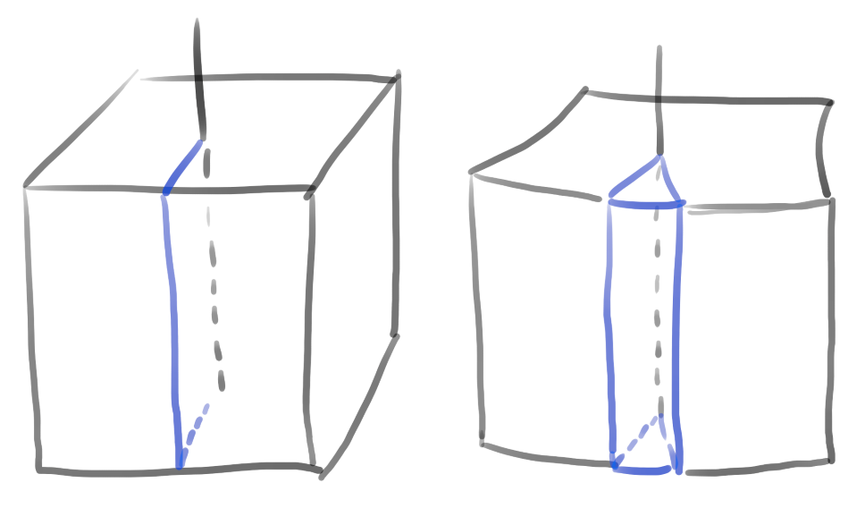
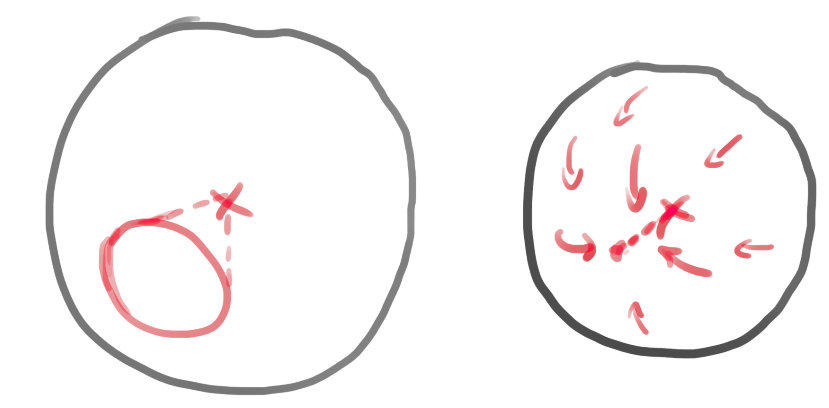
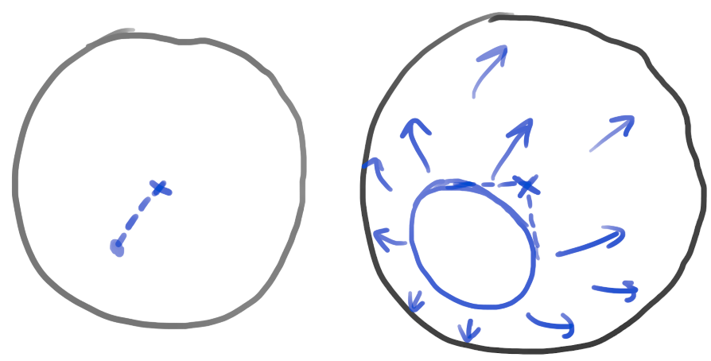

# Conical spaces

## 2D cone

### Small 2D cone

A small 2D cone in this context is a space constructed by cutting out a wedge from a space (choose two halfplanes with common boundary and remove the part between them) and gluing the remaining parts together. Each plane perpendicular to the boundary line of the wedge is thus changed to a conical surface.

### Large 2D cone

Large 2D cone is constructed by choosing a halfplane - a "cut" - and inserting a wedge into this "cut". Each plane perpendicular to the boundary line of the wedge is thus changed to a conical surface.

## 3D cone

### Small 3D cone

A small 3D cone is a space with a conical cutout, where the cut surface is "closed" - the surface is actually transformed into a ray.

### Large 3D cone

A large 3D cone is constructed by choosing a ray and inserting a conical surface into this ray. Each plane perpendicular to the ray is thus changed to a conical surface.

